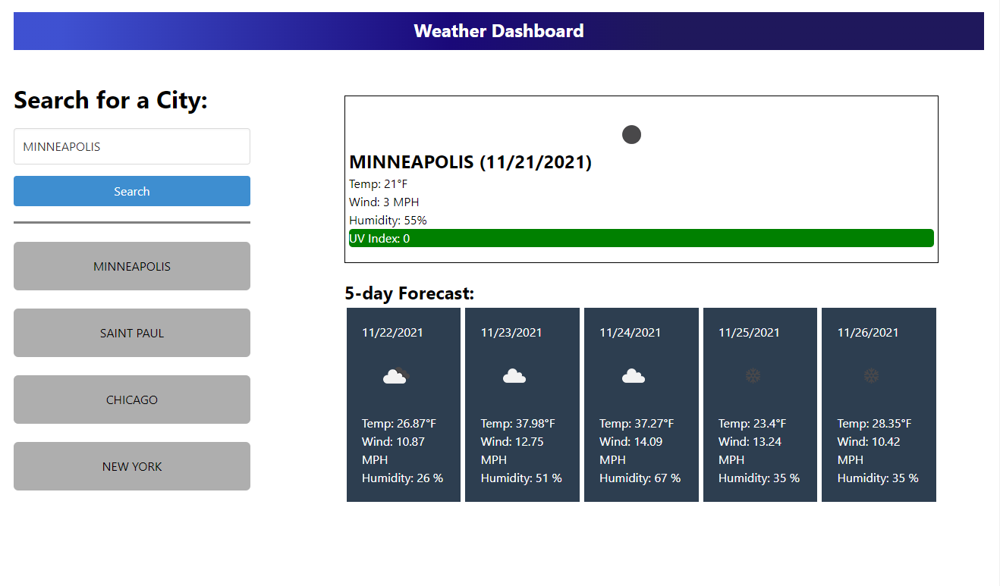

## Weather Dashboard

## Purpose
A web app that uses Open Weather API to display current and forecasted weather

## Description
In this project API manipulation allows a user to search for a city and return the weather conditions. Additionally, local storage methods allow a user to search a previously stored city for easier use. 

## Built With
* JS
* CSS
* HTML
* Bulma
* JQuery
* Moment.JS

## Third Party Libraries
* OpenWeather One Call API

## Website
You can view the live deployment [HERE](https://esimondet.github.io/challenge-six-weather-dashboard/)

## Screenshot of landing page

## Contribution
HTML, JS, CSS by Edison Simondet